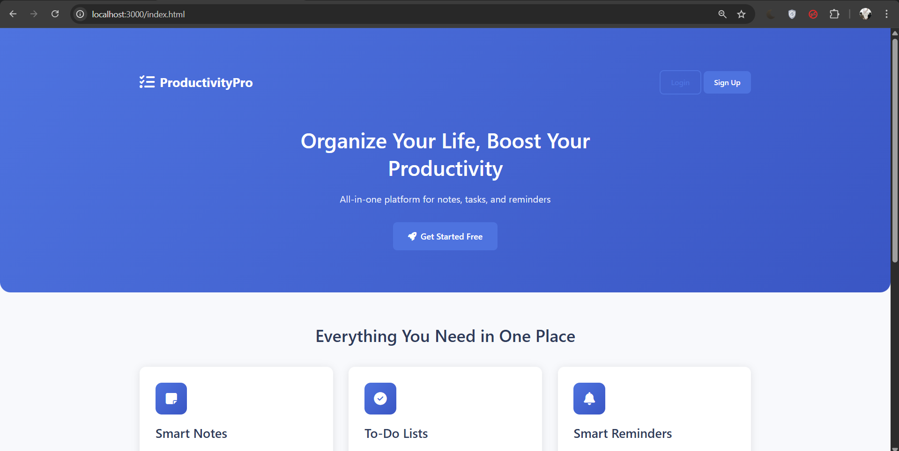
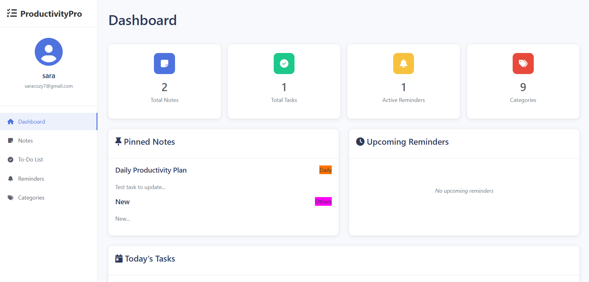
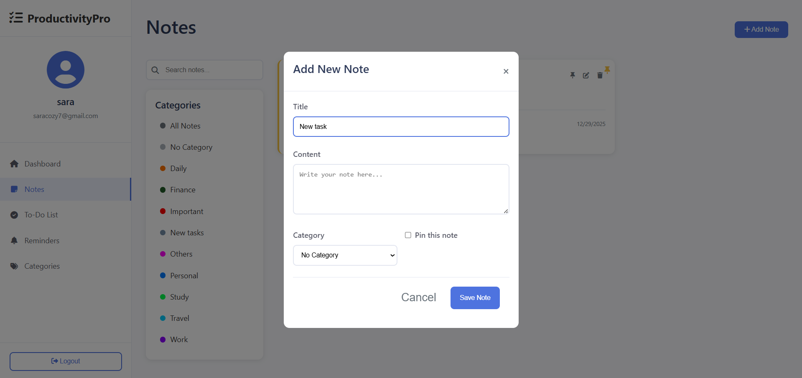
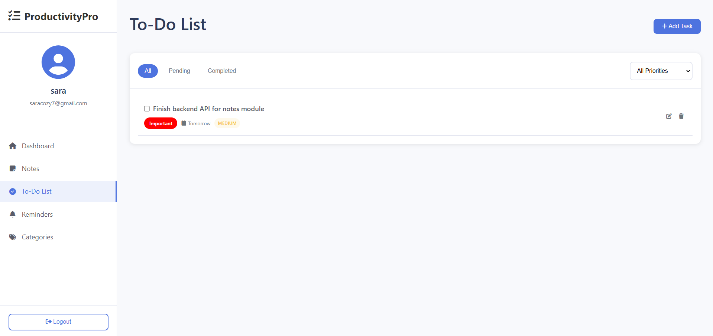
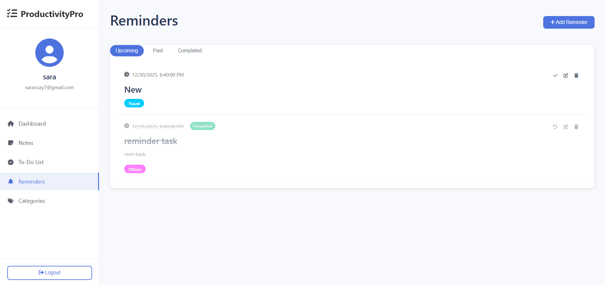

# ProductivityApp – Notes, To-Do & Reminders App

A full-stack **Productivity Management Web Application** built as part of **Internship Task 4**.
This application helps users organize their daily activities by managing **notes, to-do tasks, reminders, and categories**, all securely stored per user after authentication.

---

## 📸 Screenshots

### Home Page



### Dashboard Page



### Notes 



### todolist



### Reminder



### Category


---
## 🚀 Features

### 🔐 Authentication

* User Registration & Login
* JWT-based authentication
* Secure password hashing using **bcrypt**
* User-specific data isolation

### 📝 Notes

* Create, edit, delete notes
* Pin important notes
* Assign categories with colors
* Search and filter notes
* View pinned notes on dashboard

### ✅ To-Do List

* Add, edit, delete tasks
* Mark tasks as completed
* Set priority (Low / Medium / High)
* Assign due dates
* Filter by status & priority
* View today’s tasks on dashboard

### ⏰ Reminders

* Create time-based reminders
* Edit & delete reminders
* Mark reminders as completed
* View upcoming reminders
* Categorized reminders

### 🏷️ Categories

* Create custom categories with colors
* Edit & delete categories
* Categories shared across notes, todos, and reminders

### 📊 Dashboard

* Total notes, tasks, reminders & categories count
* Pinned notes preview
* Upcoming reminders
* Today’s tasks overview

---

## 🛠️ Tech Stack

### Frontend

* HTML5
* CSS3
* JavaScript (Vanilla JS)
* Font Awesome

### Backend

* Node.js
* Express.js
* JWT Authentication
* bcrypt.js

### Database

* MySQL

---

## 📁 Project Structure

```
TODOLIST/
│
├── css/
├── database/
├── js/
├── node_modules/
├── screenshots/
│
├── server.js
├── package.json
├── package-lock.json
├── dashboard.html
├── index.html
├── login.html
├── register.html
└── readme.md

```

---

## ⚙️ Installation & Setup

### 1️⃣ Clone the Repository

```bash
git clone https://github.com/GirishaPriyadharsini/GENTRIQ_FSD_04.git
cd GENTRIQ_FSD_04

```

### 2️⃣ Install Dependencies

```bash
npm install
```

### 3️⃣ Configure Environment Variables

Create a `.env` file:

```env
PORT=3000
DB_HOST=localhost
DB_USER=root
DB_PASSWORD=your_password
DB_NAME=productivity_app
JWT_SECRET=your_secret_key
```

### 4️⃣ Setup Database

* Create a MySQL database named `productivity_app`
* Import the SQL file:

```sql
source productivity_app.sql;
```

### 5️⃣ Run the Server

```bash
node server.js
```

Open in browser:

```
http://localhost:3000
```

---

## 🔐 API Highlights

* `POST /api/register` – Register user
* `POST /api/login` – Login user
* `GET /api/user-data` – Fetch all user data
* `CRUD /api/notes`
* `CRUD /api/todos`
* `CRUD /api/reminders`
* `CRUD /api/categories`

All protected routes use **JWT authentication**.

---

## 🎯 Internship Objective Fulfilled

✔ Notes management
✔ To-Do list with priorities
✔ Reminders with date & time
✔ Categories & tags
✔ User-specific backend data storage
✔ Secure authentication & authorization

---

Developed By

Girisaa Priyadharsini M Task 4 – Productivity App (Notes + To-Do + Reminders)
---

📄 License
This project is developed for educational and internship purposes only.
